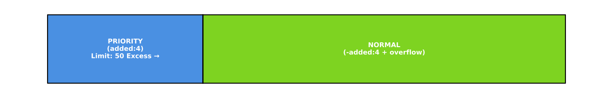

# Priority Reorder Addon

A new anki addon that reorders your cards, allowing you to prioritize certain cards. The main goal for this addon is to not only have frequency reordering but also allowing you to focus more specifically on certain cards you want to learn earlier.

For example: you could focus on recent cards (which you will have fresher memory of), cards with certain tags (maybe you tag based on the games/shows/book/etc you mined from), and also by using Yomitan occurrence diagrams to focus on cards from media you're currently consuming or plan to in the future (to learn words that you know for sure you will be seeing more often).

**Install from [AnkiWeb](https://ankiweb.net/shared/info/857040600).**

## Usage
The addon will run automatically before sync if enabled. You can also manually trigger the reordering with Ctrl+Alt+` or Tools → Reorder Cards.

The addon divides your cards into two (or more) sorted queues: **Priority** and **Normal**.


## Configuration

> **Note**: Either of the search fields may be left empty and cards will still be sorted normally just based on their sort field. The addon automatically adds `is:new` to all searches to ensure only new cards are affected.

### Basic Settings

- **`priority_search`**: Anki search string(s) for priority queue cards. Can be a single string or a list of strings for multiple priority searches (e.g., "deck:Japanese added:4" or ["deck:Japanese added:3", "deck:Japanese added:7"])
- **`priority_search_mode`**: Options: `sequential` or `mix`. Determines how to handle multiple priority searches (default: `sequential`)
    - `sequential`: each priority search will be sorted individually and ordered sequentially
    - `mix`: combines all priority searches before sorting
- **`normal_search`**: Anki search string for normal queue cards (e.g., "deck:Japanese -added:4")
    - **Note**: The addon will remove duplicates cards if included in multiple searches (keeping it only in the high priority section it appears), so you shouldn't have to actually make this search this precise to avoid conflicts.
- **`sort_field`**: Field name to sort by (e.g., "FreqSort", "Frequency")
    - **Note**: This addon requires you to use a notetype with frequencies in it to function, I recommend [Lapis](https://github.com/donkuri/lapis) if you need one. If you need to backfill cards frequencies, I recommend [backfill-anki-yomitan](https://github.com/Manhhao/backfill-anki-yomitan).
- **`sort_reverse`**: Whether to sort in descending order (default: false = ascending)

### Advanced Settings
- **`priority_cutoff`**: If a priority card's field value exceeds this (or is less than for reverse), it moves to normal queue
- **`normal_prioritization`**: If a normal card's field value is below this (or above for reverse), it moves to priority queue
- **`priority_limit`**: Maximum number of cards in the priority queue (excess cards move to normal queue)
- **`shift_existing`**: Whether to shift existing cards when repositioning (default: true)
- **`reorder_before_sync`**: Whether to automatically reorder before sync operations (default: true)

### Search Options Settings
> This section is used for configuring the addon for advanced search functionality, for now only occurrence-based searching from Yomitan dictionaries. If you don't intend on using this functionality this section can be ignored.
- **`search_fields`**:
  - **`expression_field`**: Field name containing the expression/word to match against dictionaries (default: "Expression")
  - **`expression_reading_field`**: Field name containing the reading/pronunciation to match against dictionaries (default: "ExpressionReading")

## Usage
> **Testing Search Fields**
>
> You can test your search strings in the Anki card browser to verify that they work before using them in the addon. While you can't test the occurrence logic in there, as long as you know the rest works you can verify the occurrence by initiating a manual reorder.

A simple default configuration shows an example prioritizing recently added cards:
- **Priority Queue**: `deck:日本語::Mining added:3` (cards added in the last 3 days)
- **Normal Queue**: `deck:日本語::Mining -added:3` (older cards)

Cards could instead be prioritized based on tags to prioritize certain types of content, for example:
- **Priority Queue**: `deck:日本語::Mining tag:ノベルゲーム::銀色、遥か` (specific content)
- **Normal Queue**: `deck:日本語::Mining -tag:ノベルゲーム::銀色、遥か` (other content)

### Occurrence-Based Prioritization
Cards can be prioritized based on occurrence counts from Yomitan dictionaries:
- **Priority Queue**: `deck:日本語::Mining occurrences:銀色、遥か>=50` (high frequency words)
- **Normal Queue**: `deck:日本語::Mining occurrences:銀色、遥か<50` (lower frequency words)

**Occurrence Search Patterns:**
- `occurrences:銀色、遥か>=50` - Cards with occurrence count >= 50 in dictionary `銀色、遥か`
- `occurrences:銀色、遥か<50` - Cards with occurrence count < 50 in dictionary `銀色、遥か`
- `occurrences:銀色、遥か=0` - Cards with no occurrences in dictionary `銀色、遥か`

## Examples

### Basic Usage
```json
{
    "priority_search": "deck:日本語::Mining added:3",
    "normal_search": "deck:日本語::Mining -added:3",
    "sort_field": "FreqSort",
    "sort_reverse": false
}
```


### With Multiple Priorities
```json
{
    "priority_search": ["deck:日本語::Mining added:3", "deck:日本語::Mining added:7"],
    "priority_search_mode": "sequential",
    "normal_search": "deck:日本語::Mining -added:7",
    "sort_field": "FreqSort",
    "sort_reverse": false
}
```


### With Cutoff And Prioritization Rules
```json
{
    "priority_search": "deck:日本語::Mining added:4",
    "normal_search": "deck:日本語::Mining -added:4",
    "sort_field": "FreqSort",
    "sort_reverse": false,
    "priority_cutoff": 10000,
    "normal_prioritization": 1000
}
```


This configuration means:
- Recently added cards (added:4) with frequency > 10000 move to normal queue
- Older cards (-added:4) with frequency < 1000 move to priority queue

### With Priority Limit
```json
{
    "priority_search": "deck:日本語::Mining added:4",
    "normal_search": "deck:日本語::Mining -added:4",
    "sort_field": "FreqSort",
    "sort_reverse": false,
    "priority_limit": 50
}
```


This configuration ensures that only the top 50 highest-priority cards (based on FreqSort) will be in the priority queue, regardless of how many cards match the priority search criteria.

### With Occurrence Search
```json
{
    "priority_search": "deck:日本語::Mining occurrences:銀色、遥か>=50",
    "normal_search": "deck:日本語::Mining occurrences:銀色、遥か<50",
    "sort_field": "FreqSort",
    "sort_reverse": false,
    "search_fields": {
        "expression_field": "Expression",
        "expression_reading_field": "ExpressionReading"
    }
}
```


This configuration prioritizes cards based on occurrence frequency from a Yomitan occurrence dictionary.

## Occurrence Dictionary Setup

> **Downloading occurrence dictionaries**
>
> To use the occurrence searching you will need Yomitan occurrence dictionaries. I highly recommend downloading them from [Jiten](https://jiten.moe/). In addition to having lots of useful stats on various pieces of media, they have the option of downloading occurrence dictionaries for any media they have catalogued under `Download deck -> Yomitan (occurrences)` on each piece of media's page.

To use occurrence search, you need to:
1. **Create the `user_files` directory** in your addon folder (Tools -> Addons -> Priority Reorder -> View Files)
2. **Add dictionary directories** for each dictionary you want to use:
   ```
   user_files/
   ├── 銀色、遥か/
   │   └── term_meta_bank_1.json
   ├── 君と彼女と彼女の恋。/
   │   └── term_meta_bank_1.json
   └── たねつみの歌/
       └── term_meta_bank_1.json
   ```
3. **Configure field names** to match your note type's expression and reading fields
